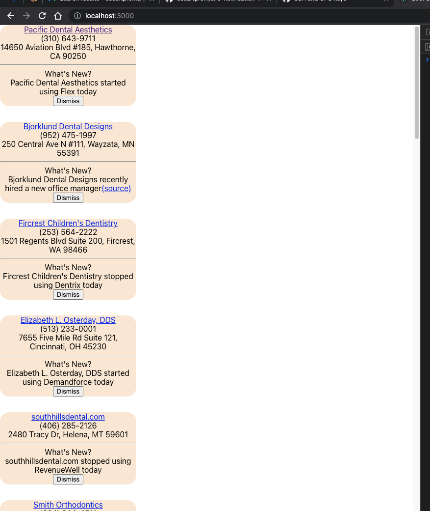

## Ciro Notification Center

### Overview
Two component: React frontend and Node.js / Express backend

### Run Locally
  - Run "$ npm i" in both ciro-backend and ciro-frontend dirs
  - Run the backend: $ cd ciro-backend && node app.js
  - Run the frontend: $ cd ciro-frontend && npm run start
  - Load http://localhost:3000 in a browser and you should see this

  

### Extensions
  - make notifications appear one at a time instead of all on screen on page load
  - convert to typescript
  - add unit & screen-render based tests
  - add static build to Express server via public directory
  - style with Material UI or other comparable library
  - use a real database, introduce User model
  - implement JWT-based auth tokens to secure user REST trasactions
  - there are also scome TODOs scattered throughout the code base
